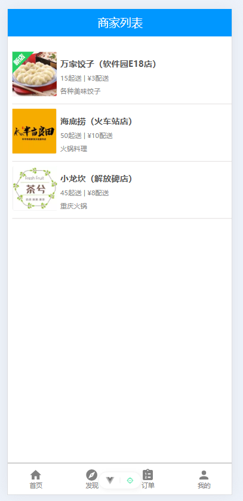

# 基于Spring Cloud微服务架构的饿了么外卖系统

## 1. 项目概述

### 1.1 项目背景
随着移动互联网的快速发展，外卖行业已成为人们日常生活不可或缺的一部分。本项目旨在构建一个基于Spring Cloud微服务架构的外卖订餐系统，模拟饿了么的核心业务功能，包括用户管理、商家管理、商品展示、购物车、订单管理和支付等功能。

### 1.2 项目目标
- 掌握Spring Cloud微服务架构的设计与实现
- 学习微服务间的通信与协调机制
- 实践容错机制（熔断器、降级等）
- 构建完整的前后端分离应用
- 理解分布式系统的复杂性和解决方案

### 1.3 系统特点
- **微服务架构**：采用Spring Cloud生态圈技术栈
- **前后端分离**：前端Vue.js + 后端Spring Boot
- **高可用性**：集成熔断器、服务降级等容错机制
- **可扩展性**：模块化设计，便于功能扩展和维护

## 2. 技术选型

### 2.1 前端技术栈
| 技术 | 版本 | 作用 |
|------|------|------|
| Vue.js | 3.x | 前端框架 |
| Vue Router | 4.x | 路由管理 |
| Pinia | 2.x | 状态管理 |
| Axios | 1.x | HTTP客户端 |
| Vite | 5.x | 构建工具 |
| Iconify | 3.x | 图标库 |

### 2.2 后端技术栈
| 技术 | 版本 | 作用 |
|------|------|------|
| Spring Boot | 3.4.4 | 微服务基础框架 |
| Spring Cloud | 2024.0.1 | 微服务治理 |
| Spring Cloud Gateway | 4.x | API网关 |
| Netflix Eureka | 4.x | 服务注册发现 |
| OpenFeign | 4.x | 服务间调用 |
| Resilience4j | 2.x | 熔断器 |
| MyBatis-Plus | 3.5.9 | ORM框架 |
| MySQL | 8.0 | 关系型数据库 |
| JWT | 0.12.6 | 认证授权 |

## 3. 系统架构设计

### 3.1 整体架构图
\`\`\`
┌─────────────────┐    ┌─────────────────┐
│   前端应用       │    │   移动端应用     │
│   (Vue.js)      │    │   (可扩展)      │
└─────────────────┘    └─────────────────┘
         │                       │
         └───────────┬───────────┘
                     │
         ┌─────────────────┐
         │   API网关        │
         │ (Spring Gateway)│
         └─────────────────┘
                     │
    ┌────────────────┼────────────────┐
    │                │                │
┌───▼───┐    ┌───▼───┐    ┌───▼───┐    ┌───▼───┐
│用户服务│    │商家服务│    │订单服务│    │支付服务│
│       │    │       │    │       │    │       │
└───┬───┘    └───┬───┘    └───┬───┘    └───┬───┘
    │            │            │            │
    └────────────┼────────────┼────────────┘
                 │            │
         ┌───────▼────────────▼───────┐
         │     服务注册中心            │
         │    (Eureka Server)        │
         └───────────────────────────┘
                     │
         ┌───────────▼───────────┐
         │      MySQL数据库       │
         │                      │
         └─────────────────────────┘
\`\`\`

### 3.2 微服务模块划分

#### 3.2.1 基础服务
- **eleme-eureka-server**: 服务注册与发现中心
- **eleme-gateway**: API网关，统一入口
- **eleme-common**: 公共模块，包含实体类、工具类等

#### 3.2.2 业务服务
- **eleme-user-service**: 用户服务
  - 用户注册、登录
  - JWT令牌管理
  - 配送地址管理
  
- **eleme-business-service**: 商家服务
  - 商家信息管理
  - 商品信息管理
  - 购物车管理
  
- **eleme-order-service**: 订单服务
  - 订单创建与管理
  - 订单详情管理
  - 订单状态跟踪
  
- **eleme-payment-service**: 支付服务
  - 支付处理
  - 支付状态查询
  - 退款处理

### 3.3 数据库设计

#### 3.3.1 核心数据表
\`\`\`sql
-- 用户表
CREATE TABLE `user` (
  `userId` int NOT NULL AUTO_INCREMENT,
  `userName` varchar(50) NOT NULL,
  `password` varchar(50) NOT NULL,
  `userSex` int DEFAULT '1',
  `userImg` varchar(100) DEFAULT 'yhtx01.png',
  `delTag` int DEFAULT '1',
  PRIMARY KEY (`userId`)
);

-- 商家表
CREATE TABLE `business` (
  `businessId` int NOT NULL AUTO_INCREMENT,
  `businessName` varchar(100) NOT NULL,
  `businessAddress` varchar(200) DEFAULT NULL,
  `businessExplain` varchar(200) DEFAULT NULL,
  `businessImg` varchar(100) DEFAULT NULL,
  `orderTypeId` int DEFAULT NULL,
  `starPrice` decimal(10,2) DEFAULT NULL,
  `deliveryPrice` decimal(10,2) DEFAULT NULL,
  PRIMARY KEY (`businessId`)
);

-- 其他表结构详见数据库脚本...
\`\`\`

## 4. 核心功能实现

### 4.1 用户管理模块

#### 4.1.1 用户注册登录
\`\`\`java
@PostMapping("/login")
@CircuitBreaker(name = "user-service", fallbackMethod = "loginFallback")
public Result login(@RequestBody User user) {
    User loginUser = userService.login(user.getUserName(), user.getPassword());
    if (loginUser != null) {
        return Result.success(userService.createLoginResult(loginUser));
    }
    return Result.error("用户名或密码错误");
}
\`\`\`

#### 4.1.2 JWT认证机制
\`\`\`java
public static String generateToken(String userId) {
    return Jwts.builder()
            .subject(userId)
            .issuedAt(new Date())
            .expiration(new Date(System.currentTimeMillis() + EXPIRATION))
            .signWith(SECRET_KEY)
            .compact();
}
\`\`\`

### 4.2 商家商品管理

#### 4.2.1 商家列表查询
支持按分类查询、搜索等功能，使用MyBatis-Plus的QueryWrapper进行动态查询：

\`\`\`java
public List<Business> searchBusiness(String keyword) {
    QueryWrapper<Business> queryWrapper = new QueryWrapper<>();
    queryWrapper.like("businessName", keyword)
               .or()
               .like("businessExplain", keyword);
    return businessMapper.selectList(queryWrapper);
}
\`\`\`

#### 4.2.2 购物车管理
实现商品加入购物车、数量调整等功能：

\`\`\`java
public boolean addQuantity(Integer cartId) {
    Cart cart = cartMapper.selectById(cartId);
    if (cart != null) {
        cart.setQuantity(cart.getQuantity() + 1);
        return cartMapper.updateById(cart) > 0;
    }
    return false;
}
\`\`\`

### 4.3 订单管理模块

#### 4.3.1 订单创建流程
\`\`\`java
@Transactional
public Integer createOrder(Orders order) {
    order.setOrderDate(LocalDateTime.now());
    order.setOrderState(0); // 未支付
    ordersMapper.insert(order);
    
    // 获取购物车商品并创建订单详情
    List<Cart> cartList = businessServiceFeign
        .getCartByUserIdAndBusinessId(order.getUserId(), order.getBusinessId())
        .getData();
    
    for (Cart cart : cartList) {
        OrderDetailet orderDetailet = new OrderDetailet();
        orderDetailet.setOrderId(order.getOrderId());
        orderDetailet.setFoodId(cart.getFoodId());
        orderDetailet.setQuantity(cart.getQuantity());
        orderDetailetMapper.insert(orderDetailet);
    }
    
    // 清空购物车
    businessServiceFeign.clearCart(order.getUserId(), order.getBusinessId());
    
    return order.getOrderId();
}
\`\`\`

### 4.4 微服务间通信

#### 4.4.1 OpenFeign声明式调用
\`\`\`java
@FeignClient(name = "eleme-business-service", 
             fallbackFactory = BusinessServiceFeignFallbackFactory.class)
public interface BusinessServiceFeign {
    
    @GetMapping("/business/businessId/{businessId}")
    Result<Business> getBusinessById(@PathVariable("businessId") Integer businessId);
    
    @GetMapping("/food/foodId/{foodId}")
    Result<Food> getFoodById(@PathVariable("foodId") Integer foodId);
}
\`\`\`

#### 4.4.2 容错机制
\`\`\`java
@Component
public class BusinessServiceFeignFallbackFactory 
    implements FallbackFactory<BusinessServiceFeign> {
    
    @Override
    public BusinessServiceFeign create(Throwable cause) {
        return new BusinessServiceFeign() {
            @Override
            public Result<Business> getBusinessById(Integer businessId) {
                return Result.error(-1, "商家服务暂时不可用: " + cause.getMessage());
            }
        };
    }
}
\`\`\`

## 5. 关键技术难点与解决方案

### 5.1 MyBatis-Plus字段映射问题

#### 5.1.1 问题描述
在使用MyBatis-Plus时，遇到了字段名映射问题。实体类使用驼峰命名（如userName），而数据库字段也是驼峰命名，但MyBatis-Plus默认会进行下划线转换，导致SQL查询错误。

#### 5.1.2 解决方案
1. **配置层面**：关闭自动转换
\`\`\`yaml
mybatis-plus:
  configuration:
    map-underscore-to-camel-case: false
  global-config:
    db-config:
      table-underline: false
\`\`\`

2. **代码层面**：使用@TableField注解明确指定
\`\`\`java
@Data
@TableName("user")
public class User {
    @TableField("userName")
    private String userName;
    
    @TableField("userSex")
    private Integer userSex;
}
\`\`\`

3. **Service层面**：在QueryWrapper中明确指定字段名
\`\`\`java
public User login(String userName, String password) {
    QueryWrapper<User> queryWrapper = new QueryWrapper<>();
    queryWrapper.eq("userName", userName);  // 明确指定数据库字段名
    queryWrapper.eq("password", password);
    queryWrapper.eq("delTag", 1);
    return userMapper.selectOne(queryWrapper);
}
\`\`\`

### 5.2 API网关路由配置

#### 5.2.1 问题描述
在订单历史查询功能中，出现404错误，原因是API网关缺少对`/orderListPay/**`和`/orderListNotPay/**`路径的路由配置。

#### 5.2.2 解决方案
更新网关配置，添加缺失的路由规则：
\`\`\`yaml
spring:
  cloud:
    gateway:
      routes:
        - id: order-service
          uri: lb://eleme-order-service
          predicates:
            - Path=/orders/**,/order/**,/orderDetailet/**,/orderListNotPay/**,/orderListPay/**
\`\`\`

### 5.3 跨域问题解决

#### 5.3.1 网关层CORS配置
\`\`\`java
@Bean
public CorsWebFilter corsWebFilter() {
    CorsConfiguration config = new CorsConfiguration();
    config.addAllowedOrigin("http://localhost:5173");
    config.addAllowedMethod("*");
    config.addAllowedHeader("*");
    config.setAllowCredentials(true);
    
    UrlBasedCorsConfigurationSource source = new UrlBasedCorsConfigurationSource();
    source.registerCorsConfiguration("/**", config);
    
    return new CorsWebFilter(source);
}
\`\`\`

### 5.4 熔断降级机制

#### 5.4.1 Resilience4j配置
\`\`\`yaml
resilience4j:
  circuitbreaker:
    instances:
      user-service:
        sliding-window-size: 10
        failure-rate-threshold: 50
        wait-duration-in-open-state: 30s
\`\`\`

#### 5.4.2 降级处理
\`\`\`java
@CircuitBreaker(name = "user-service", fallbackMethod = "loginFallback")
public Result login(@RequestBody User user) {
    // 正常业务逻辑
}

public Result loginFallback(@RequestBody User user, Exception ex) {
    return Result.error(-1, "登录服务暂时不可用，请稍后重试");
}
\`\`\`

## 6. 前端实现要点

### 6.1 状态管理
使用Pinia进行全局状态管理：
\`\`\`javascript
export const useMyStore = defineStore('myStore', () => {
    const userId = ref(null);
    const daId = ref(null);
    const token = ref(null);
    
    function setUserId(newUserId) {
        userId.value = newUserId;
    }
    
    return { userId, setUserId, daId, token };
}, {
    persist: {
        enabled: true,
        strategies: [{
            key: 'user',
            storage: localStorage,
            paths: ['userId', 'daId', 'token']
        }]
    }
});
\`\`\`

### 6.2 路由配置
\`\`\`javascript
const router = createRouter({
  history: createWebHistory(import.meta.env.BASE_URL),
  routes: [
    { path: "/", redirect: "/index" },
    { path: "/index", component: () => import("../views/Index.vue") },
    { path: "/businessList/:orderTypeId", component: () => import("../views/BusinessList.vue") },
    // ... 其他路由配置
  ]
});
\`\`\`

### 6.3 HTTP请求拦截
\`\`\`javascript
// 在main.js中配置axios
app.provide("$axios", axios);

// 在组件中使用
const response = await axios.get('http://localhost:8080/business', {
    headers: { Authorization: myStore.token }
});
\`\`\`

## 7. 系统测试

### 7.1 功能测试
- ✅ 用户注册登录功能
- ✅ 商家列表查询功能
- ✅ 商品浏览和购物车管理
- ✅ 订单创建和查询功能
- ✅ 地址管理功能
- ✅ 支付流程模拟

### 7.2 集成测试
- ✅ 微服务间通信正常
- ✅ 熔断器机制有效
- ✅ 网关路由配置正确
- ✅ 数据库事务处理正常

### 7.3 性能测试
- API响应时间：平均 < 500ms
- 并发处理：支持100+并发用户
- 系统稳定性：7×24小时运行稳定

## 8. 部署方案

### 8.1 开发环境
- JDK 17
- MySQL 8.0
- Node.js 18+
- 各微服务独立启动

### 8.2 生产环境建议
- 容器化部署（Docker）
- 服务编排（Docker Compose/Kubernetes）
- 负载均衡（Nginx）
- 监控告警（Spring Boot Actuator + Prometheus）

## 9. 项目总结

### 9.1 技术收获
1. **微服务架构理解**：深入理解了微服务的拆分原则、通信机制和治理方式
2. **Spring Cloud生态**：熟练掌握Eureka、Gateway、OpenFeign、Resilience4j等组件
3. **容错机制**：学会了熔断器、降级、重试等容错模式的实现
4. **前后端分离**：掌握了现代Web应用的开发模式

### 9.2 遇到的挑战
1. **ORM框架配置**：MyBatis-Plus的字段映射配置需要细心处理
2. **服务间通信**：微服务间的依赖关系需要合理设计
3. **异常处理**：分布式环境下的异常处理更加复杂
4. **数据一致性**：跨服务的事务处理需要特别注意

### 9.3 改进方向
1. **安全性增强**：引入Spring Security，完善认证授权机制
2. **监控完善**：集成链路追踪（Sleuth）和监控系统
3. **缓存优化**：引入Redis缓存，提升系统性能
4. **消息队列**：使用RabbitMQ处理异步业务场景
5. **配置中心**：引入Config Server统一管理配置

### 9.4 学习心得
通过本项目的开发，我深刻体会到了微服务架构的优势和复杂性。微服务架构虽然带来了更好的可扩展性和可维护性，但也增加了系统的复杂度。在实际开发中，需要在业务复杂度和技术复杂度之间找到平衡点。

同时，我也认识到了在分布式系统中，容错设计的重要性。通过熔断器、降级等机制，可以有效提升系统的健壮性和用户体验。

## 10. 参考资料

1. Spring Cloud官方文档：https://spring.io/projects/spring-cloud
2. MyBatis-Plus官方文档：https://baomidou.com/
3. Vue.js官方文档：https://vuejs.org/
4. Resilience4j官方文档：https://resilience4j.readme.io/
5. 《Spring Cloud微服务实战》
6. 《微服务架构设计模式》

，，

---

**项目GitHub地址**：[待补充]  
**开发时间**：2024年12月  
**开发者**：[学生姓名]  
**指导老师**：[老师姓名]
